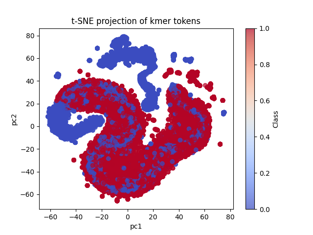

# Machine Learning *RNA Biotype Classification*

### Compiled by *Desmond Akabetso Nde*
### last updated on *11 of November 2025*
### *If you find this interesting or have any desagreements, do not hesitate to comment them out, thank you* 

## Aim: 
In this repo, I thrive to implement the collections of  knowledge and skills learned from MIT online sources, CNRS online, publications and other available resources!

Implement kmer tokenization, embedding and neural network to classify rna biotypes into coding and non coding rna

## Workflow:

Get coding and non coding genes from ncbi

apply kmer tokenization, embedding (capture sequence structure and kmer similatities) and  positional representations (sequence order)

Train the multilayer peceptrons to recornize coding/non coding patterns

evaluated on genes from ncbi with a 98% accuracy prediction

27500 * 27500 coding and non coding rna of sequence sizes ranging from 100 to about 3200 bp (see figures bellow)

kmers extractions are performed not every bp position but every kmer length to cut down overlap!
cutting down overlaps, reduces vector sizes and hence memory.

  
  

Figure - Vector disttributions of kmer. 0 for non coding and 1 for coding RNA. Left: t-SNE, right: PCA
